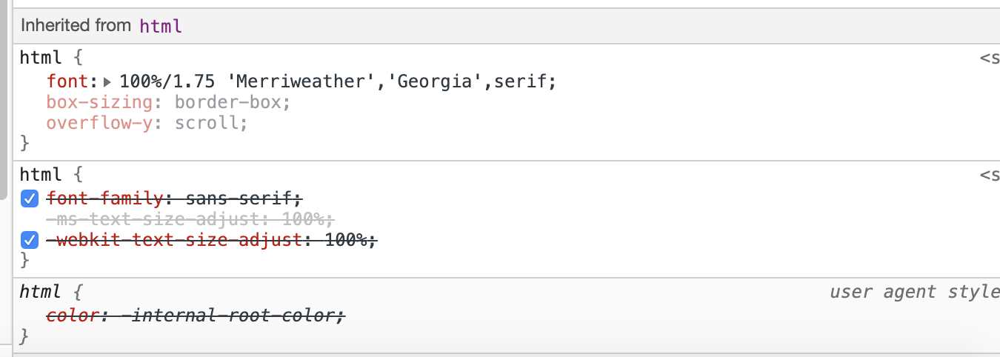
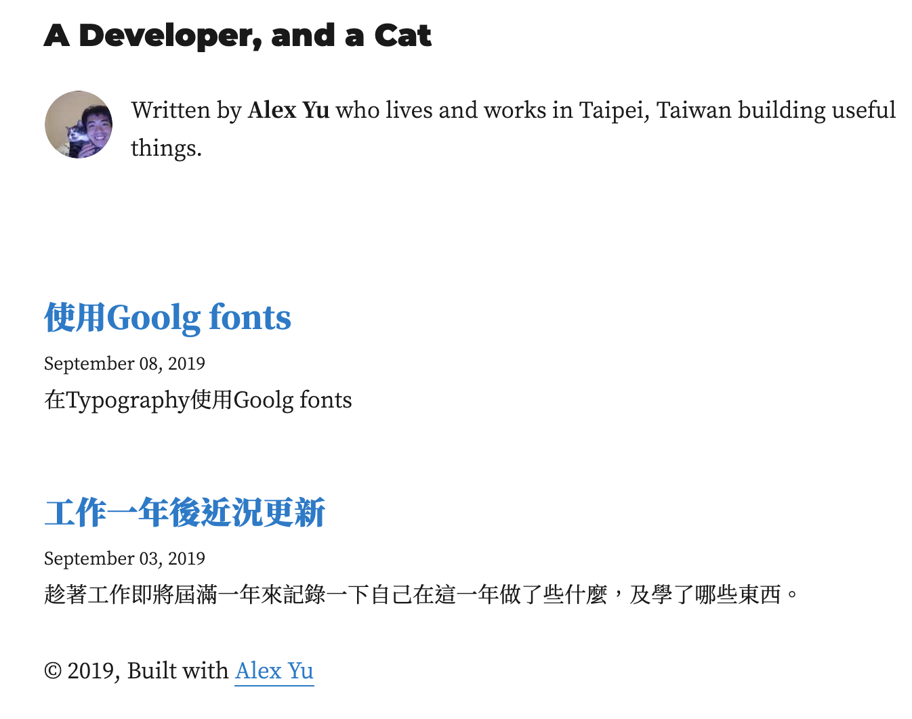

### Typography
一開始打完第一篇的時候, 發現字體看了不是很順眼. 由於沒有用過Typography, 所以不是很確定如何更換字體, google了一下發現有人說在`layout.css`加上google font的url並且在html加上font-family屬性[[1]](https://stackoverflow.com/questions/47488440/how-do-i-add-google-fonts-to-a-gatsby-site), 不過我試了發現沒有用,


我猜原因是在`layout.js`裡面有設定了
```
<h3
	style={{
		fontFamily: `Montserrat, sans-serif`,
			marginTop: 0,
		}}
	>
```

而且我不是很喜歡在這種直接在css裡面設定style的做法.

所以我便看了一下Typography.js的官方文件, 有寫著`googleFonts`, `headerFontFamily`, `bodyFontFamily`的設定[[2]](https://kyleamathews.github.io/typography.js/), 於是便在`src/utils/typography.js`裡面加上

```
Wordpress2016.headerFontFamily = ['Noto Serif TC', 'sans-serif'];
Wordpress2016.bodyFontFamily = ['Noto Serif TC', 'sans-serif'];
Wordpress2016.googleFonts = [
	{
		name: 'Noto Serif TC',
		styles: [
			"400",
			"500",
			"600",
			"700",
			"900",
		]
	}
];
```
便更改成功了,

*before*


*after*


*before*


*after*


***

### 後續
之後會再將字體下載下來放到font資料夾, 以加快整體網頁的讀取速度, 以及文章內加入`hightlight.js`.


### Reference
[1] https://stackoverflow.com/questions/47488440/how-do-i-add-google-fonts-to-a-gatsby-site

[2] https://kyleamathews.github.io/typography.js/
